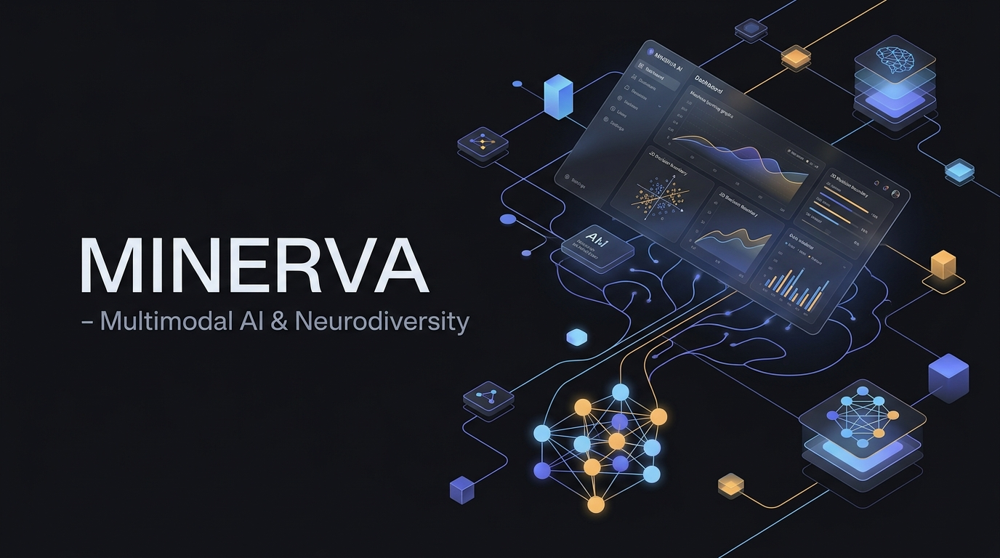
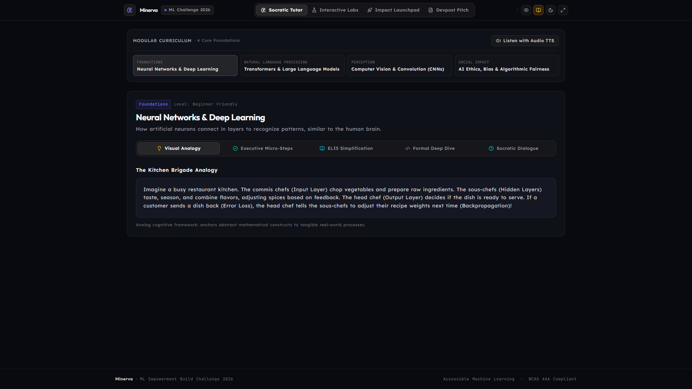
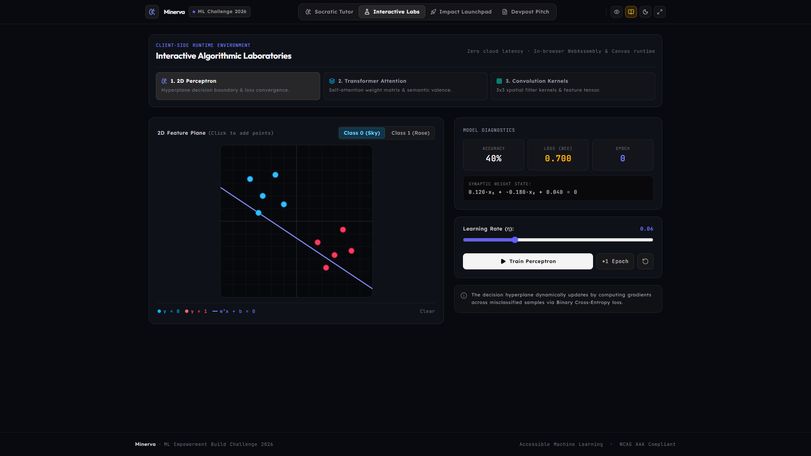
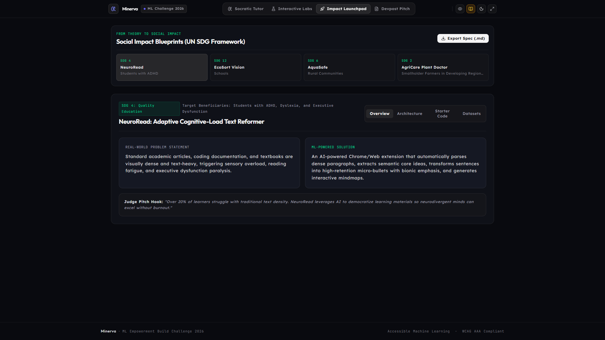
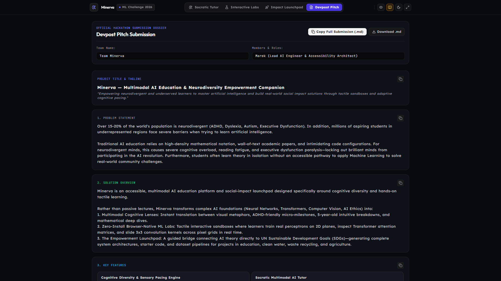

# Minerva — Multimodal AI Education & Neurodiversity Empowerment Companion 🧠✨

> Built for the **ML Empowerment Build Challenge 2026** (Global AI Hackathon on Devpost).  
> *Empowering neurodivergent and underserved learners to master artificial intelligence and build real-world social impact solutions through tactile sandboxes and adaptive cognitive pacing.*

[](https://react.dev/)
[](https://vite.dev/)
[](https://tailwindcss.com/)
[](https://www.w3.org/WAI/standards-guidelines/wcag/)
[](https://opensource.org/licenses/MIT)



---

## 🌟 The Mission & Problem Statement

Over **15–20% of the global population is neurodivergent** (ADHD, Dyslexia, Autism, Executive Dysfunction). In addition, millions of aspiring students in underrepresented communities face steep barriers when trying to learn artificial intelligence.

Traditional AI education relies on:
- High-density mathematical notation without tangible grounding
- Wall-of-text academic papers triggering severe reading fatigue and executive dysfunction paralysis
- Intimidating terminal and GPU setups requiring high-end machines

**Minerva** breaks this barrier by turning abstract Machine Learning concepts into **tactile, browser-native, multimodal sandboxes** equipped with sensory pacing and direct pipelines to solve **UN Sustainable Development Goals (SDGs)**.

---

## 🚀 Key Modules & Architecture

### 1. 🎓 Socratic Multimodal AI Tutor
Transforms complex AI foundations into 5 adaptive cognitive lenses:
- **💡 Metaphor & Story Lens:** Real-world physical analogies (e.g., *The Kitchen Brigade* for neural layers, *The Cocktail Party* for Transformer self-attention).
- **🧩 ADHD Micro-Milestones:** Chunked step-by-step progress with dopamine confetti celebrations to defeat executive paralysis.
- **🧒 Explain Like I'm 10:** Jargon-free, intuitive explanations.
- **⚙️ Mathematical & Code Deep-Dive:** Precise equations, gradient descent calculus, and matrix formulations.
- **💬 Socratic Dialogue & Active Recall:** Minerva asks challenging questions and analyzes the student's reasoning in real time.
- **🔊 Web Speech Audio Narration:** Calibrated cadence text-to-speech for students with dyslexia or visual fatigue.

### 2. 🧪 Interactive Browser-Native ML Labs
Zero install, zero cloud latency. Real algorithms running live in the browser:
- **Lab 1: Perceptron 2D Trainer:** Interactive Cartesian plane with live decision-boundary hyperplane adjustment, real-time loss tracking, epoch slider, and accuracy metrics.
- **Lab 2: Transformer Self-Attention & Sentiment Studio:** Interactive token attention matrix, dynamic attention weights (Softmax scores), and emotional polarity gauge.
- **Lab 3: Computer Vision & Convolution Studio:** Interactive 10x10 pixel drawing canvas with real-time 3x3 convolution kernels (Sobel horizontal/vertical, Sharpen, Gaussian Blur) and feature map rendering.

### 3. 🚀 The Empowerment Launchpad (AI for Good)
Directly bridges student learning into social impact projects aligned with the UN SDGs:
- **NeuroRead AI (SDG 4: Quality Education):** Adaptive cognitive-load text reformer for neurodivergent learners.
- **EcoSort Vision (SDG 12: Responsible Consumption):** Edge computer vision model for municipal waste sorting.
- **AquaSafe (SDG 6: Clean Water):** IoT predictive sentinel for microbial water contamination.
- **AgriCare Plant Doctor (SDG 2: Zero Hunger):** Quantized offline mobile model diagnosing crop pathology for smallholder farmers.
- *Includes runnable Python starter pipelines, system architecture diagrams, and curated open-source datasets.*

### 4. 🏆 Devpost Ready Submission Engine
Built-in exporter generating the complete pitch deck, problem statement, solution overview, tech stack, and team details ready to submit with 1 click.

---

## 🎛️ Neurodiversity & Sensory Accessibility Toolbar

Minerva features dedicated controls built directly into the header:
- **Bionic Reading:** Emphasizes word beginnings to anchor ADHD eye fixation and increase reading speed.
- **Dyslexia Font Mode:** Utilizes scientifically engineered typography (Lexend) with wide letter-spacing and line height.
- **Sensory Themes:**
  - *Calm Lavender:* Low-glare, calming palette for autistic and ADHD users.
  - *Cyber Dark:* OLED contrast.
  - *High Contrast (WCAG AAA):* Ultra-crisp yellow/white on deep black for visual impairments.
  - *Warm Paper:* Daylight sepia warmth eliminating blue-light eyestrain.
- **Focus Mode:** Collapses non-essential interface elements to prevent sensory overload.

---

---

## 📸 Media Showcase & Demo Video

| Socratic AI Tutor | Interactive ML Laboratories |
| :---: | :---: |
|  |  |

| Impact Launchpad (UN SDG) | Devpost Pitch Submission |
| :---: | :---: |
|  |  |

### 🎬 Walkthrough Video
The 33-second high-definition interactive demo walkthrough is available in:  
📁 [`media/minerva_demo_video.mp4`](./media/minerva_demo_video.mp4)

---

## 🛠️ Tech Stack

- **Frontend:** React 19, Vite 8, Tailwind CSS v4, Lucide React
- **Visual Computing & Graphics:** HTML5 Canvas API, SVG vector charts
- **Audio & Accessibility:** Web Speech API (`SpeechSynthesis`), OpenDyslexic / Lexend typography
- **Gamification:** Canvas Confetti micro-rewards
- **Reference ML Pipelines:** PyTorch, Hugging Face Transformers, ONNX, Scikit-learn, TensorFlow Lite

---

## 💻 Local Setup & Development

```bash
# 1. Clone the repository
git clone https://github.com/mareknardella-lgtm/Minerva.git
cd Minerva

# 2. Install dependencies
npm install

# 3. Start local development server
npm run dev

# 4. Open in browser
# http://localhost:5173
```

---

## 👥 Team & Hackathon Submission

- **Challenge:** ML Empowerment Build Challenge 2026
- **Track:** AI for Social Good & Accessible Education
- **Submission:** Full prototype with live interactive sandboxes, curriculum, and Devpost pitch ready.
